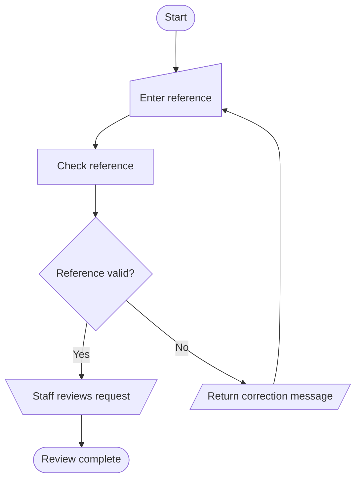

# Flowchart symbols and semantics

Read when creating, reviewing, or correcting a process flowchart. This is part of application-documentation, not another skill. Choose each node's semantic category before its shape. Do not make every node a generic rectangle, or add unused symbols just to make a diagram look complete.

## Notation contract

Use the conventional software/process-flowchart mapping below as the default project convention. Name any explicitly requested formal standard and edition; verify against its actual requirements before claiming conformance. A Mermaid rendering or this convention alone does not establish ISO/ANSI compliance. Preserve an established valid project notation and explain any conversion.

Keep notations distinct: a process flowchart, UML activity diagram, BPMN process, DFD, sitemap, and C4 architecture have different semantics. Mermaid's flowchart engine can draw several of them; its use does not turn them all into process flowcharts. In particular, do not carry UML start/final circles into an otherwise conventional process flowchart or use a decision diamond to imply parallel execution.

## Symbol selection

Conventional shape meanings are summarized from [RFFlow's flowchart symbol guide](https://www.rff.com/flowchart_shapes.php). Mermaid identifiers follow its [official shape documentation](https://mermaid.js.org/syntax/flowchart.html). Treat the shape column as the semantic contract and the identifier as a rendering choice, not proof of standards compliance.

| Meaning | Conventional shape | Mermaid shape ID |
| --- | --- | --- |
| Start / end (terminator) | Oval or stadium/pill | `stadium` |
| Process | Rectangle | `rect` |
| Decision | Diamond | `diam` |
| Input / output | Parallelogram (jajar genjang) | `lean-r` |
| Manual input | Quadrilateral with sloping top (keyboard-like) | `sl-rect` |
| Manual operation | Trapezoid, wider at top | `trap-t` |
| Preparation / initialization | Hexagon | `hex` |
| Predefined process / subroutine | Rectangle with double vertical sides | `fr-rect` |
| Document | Rectangle with wavy bottom | `doc` |
| Multiple documents | Stacked document shapes | `docs` |
| Database | Cylinder | `cyl` |
| Display | Screen-shaped outline | `curv-trap` |
| Delay / waiting | D-shaped outline | `delay` |
| On-page connector | Small labeled circle | `circle` |
| Off-page connector | Downward-pointing pentagon | Use a verified equivalent vector shape |
| Annotation | Bracket with association line | `brace` |
| Flow direction | Line with arrowhead | `-->` |

Apply these rules when assigning the symbols:

- Separate a human entering values from software receiving those values, processing them, and returning an output. Use manual input when the act of typing matters; use general input/output for a transfer without that distinction. Keep the chosen level of detail consistent.
- Separate human work from a decision based on its result: a reviewer performs a manual operation; a diamond then expresses whether the review passed. A software-triggering click is not automatically a manual operation. Identify who performs the work in the label or lane.
- Do not swap the manual-operation trapezoid with an upward-narrowing trapezoid, a manual-input shape, or a display just because their silhouettes are similar.
- Label processes with actions and decisions with conditions/questions. Calculating a validation result is a process; branching on the result is a decision. Do not split them unless both steps add needed information.
- A database node represents a store, not the instruction to save. Show the write as a process and, if the store is needed, associate it with a labeled data-access edge distinguished from control flow. A database failure decision must follow an operation/result, not imply that the cylinder performs validation.
- A generated document is an artifact; generation itself is work. Likewise, preparation describes setup, and delay describes actual waiting. Do not invent setup, files, waits, or subprocesses merely to use every shape.
- Reference the definition of a predefined process. Label connector pairs with matching IDs and a target section/page for off-page continuation; do not leave readers guessing where a path resumes.

## Edges, branching, and layout

Use a top-down layout by default; choose left-to-right only when it stays compact. Keep start/entry and outcome/exit points evident, including cancellation and failure where supported. Multiple genuine end states are allowed. For ongoing/event-driven work, label the waiting/re-entry behavior rather than inventing a finite end.

Label every decision exit with an explicit condition, such as Yes/No, Valid/Invalid, or named states. Check that conditions are mutually exclusive and cover the supported outcomes; add an otherwise/error path only when it exists or is explicitly proposed. A diamond with one unlabeled exit is not a useful decision. A retry loop needs a reason, return point, and supported stop/escape behavior.

Prefer one control successor for a normal sequential step. Explain intentional fan-out and synchronization; branching is not automatically parallelism. Keep normal, error, data-access, and annotation edges visually distinguishable through labels and an appropriate legend. Do not use color alone. Avoid lines crossing labels or nodes; crossings do not imply joins. Place joins/connectors explicitly when needed.

Use the same symbol for the same meaning throughout a document. Include a compact legend of the symbols actually used. Split by subprocess, role, or page rather than shrinking text; preserve readable arrowheads and clear connection points at normal display/export size.

## Mermaid compatibility

Expanded shapes use `N@{ shape: sl-rect, label: "Enter reference" }` and require Mermaid 11.3.0 or later. Verify the installed renderer and each selected shape, rather than assuming the host preview and exporter support the same syntax. Older syntax remains useful for basic shapes: `S(["Start"])`, `P["Process"]`, `D{"Valid?"}`, `I[/"Receive data"/]`, `M[\"Manual review"/]`, `R[["Run defined check"]]`, `DB[("Records")]`.

If a requested shape is unavailable, pre-render with an available compatible local renderer or use precise editable SVG/draw.io. Do not download another skill, invent unsupported syntax, silently replace all symbols with rectangles, or repurpose a differently shaped pentagon as an off-page connector. Disclose any unavoidable approximation and do not claim exact notation compliance.

## Illustrative pattern

This hypothetical review flow demonstrates shape selection; it is not evidence about the user's application. Use expanded syntax only after confirming compatibility. Other symbols belong only where their meaning occurs.

Typing, automated checking, human review, and returned output have separate meanings. The No branch returns to input for correction; the Yes branch completes the stated review step. The example makes no claim about approval or a later business outcome.

## Review and correction gate

1. Inventory each existing node as entry/exit, work, decision, input/output, human input/work, artifact, storage, or continuation. Compare its actual meaning with its symbol; correct shape mismatches without changing source-grounded behavior.
2. Trace every branch and loop from an entry to a supported outcome or an explicitly explained ongoing state. Check connector pairs, unexplained disconnected nodes, conditions, and responsibilities. Record unknown behavior instead of inventing missing routes.
3. Validate syntax with the target parser and render the flow. Inspect symbol geometry, especially the two manual shapes, along with labels, legend, edge direction and intersections. Bind visual endpoints to the actual shape perimeter, not just its rectangular bounds: sloped manual-input tops and wavy document bottoms otherwise leave visible gaps. Keep arrow tips touching the intended outline and labels inside their allocated frame/lane area without covering edges. Parsing alone cannot detect a semantically wrong shape.
4. Check actual PDF/PPTX/PNG/JPG output when requested: shape silhouettes, arrowheads, decision labels, and paired connector references must survive conversion. Use the browser-artifact workflow for export gates; a visually attractive screenshot is not proof of correct logic.
5. Report precisely which checks were performed. If renderer support is unavailable, provide the corrected source with that limitation; do not claim a rendered or formally certified result.
